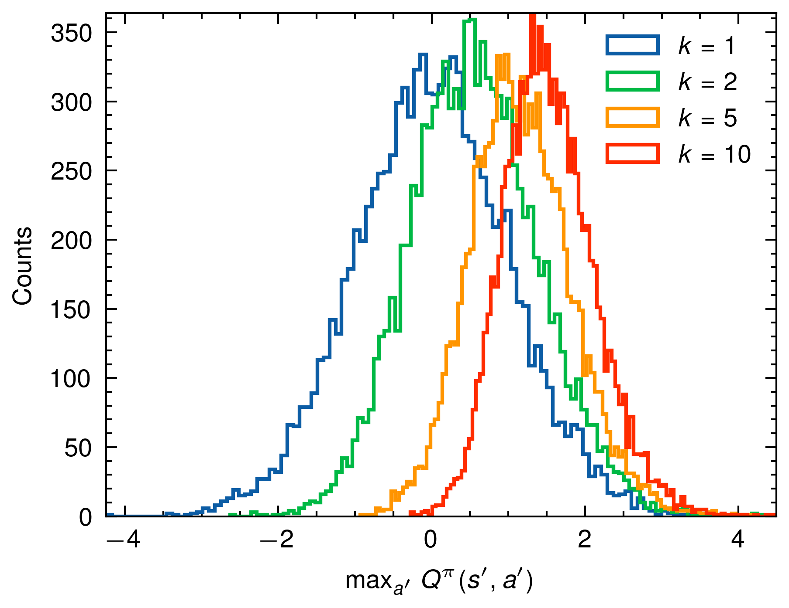

# Optimizer's Curse Validation in Rust

This project demonstrates and validates the concept of the "Optimizer's Curse" using the Rust programming language. The program utilizes parallel processing (via the `rayon` crate) for efficient computation and provides options for both computing the expected max Q value and generating its distribution. Additionally, a Python plotting script is included to visualize the distribution.

## Prerequisites

- Rust and Cargo installed on your system.
- Python with required packages: `pandas`, `matplotlib`, and `scienceplots`.

## Dependencies

### Rust

- `peroxide`: Used for statistical functions.
- `rayon`: For parallel data processing.
- `dialoguer`: For interactive command-line prompts.

### Python

- `pandas`: For data manipulation.
- `matplotlib`: For plotting.
- `scienceplots`: For styling the plots.

## Features

1. **Compute Expected max Q in Rust**: Compute the expected maximum Q value for a given number of samples (`k`).
2. **Generate max Q Distribution in Rust**: Generate the distribution of max Q values for multiple `k` values and save it in a Parquet file format.
3. **Visualize Distribution with Python**: A Python script to read the Parquet file and plot the max Q distribution.

## How to Run

### Rust Application

1. Clone this repository.
2. Navigate to the project directory.
3. Run the following command:
```bash
cargo run --release
```
4. Follow the on-screen prompts.

### Python Plotting Script

After you've generated the `distribution.parquet` using the Rust application:

1. Ensure you've installed the required Python packages. You can use:
```bash
pip install pandas matplotlib scienceplots
```

2. Run the script:
```bash
python plot_script.py
```

3. A plot named `dist_plot.png` will be saved in the project directory.

## Function Descriptions

### Rust

- `main()`: The primary entry point. Prompts the user to select a mode of operation and processes the request.
  
- `expected_max_Q(k: usize) -> f64`: Returns the expected maximum Q value for a given `k`.

- `experiment(n: usize, k: usize) -> f64`: Executes the `expected_max_Q` function `n` times in parallel.

- `experiment_dist(n: usize, k: usize) -> Vec<f64>`: Computes a vector of max Q values.

### Python

- The Python script first reads the `distribution.parquet` file and prepares the data for plotting.
- It then plots histograms for the different `k` values and saves the plot as `dist_plot.png`.

## Results



## License

This project is open-sourced under the [MIT License](LICENSE).
