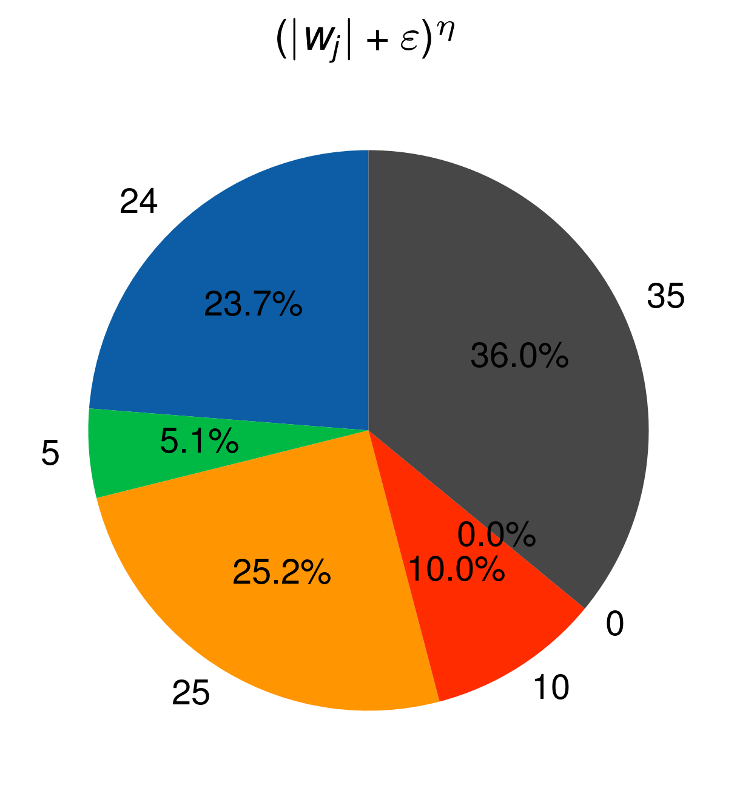

# SumTree in Rust

This project implements a SumTree in Rust and provides a way to visualize the distribution of its sampling results using Python.

## Overview

SumTree is a binary tree where each node holds a value which is the sum of the values of its child nodes. Given a random value between 0 and the total sum (root node value), the `sample` method of the SumTree returns a leaf node value. This project aims to test and visualize the distribution of these sampled values.

## Dependencies

- Rust
    - Peroxide
- Python
    - pandas
    - pyarrow
    - matplotlib
    - scienceplots

## File Descriptions

- `src/main.rs`: This is the main Rust code which implements the SumTree data structure and samples it. The sampling distribution is then saved as a Parquet file.

- `pq_plot.py`: This Python script reads the Parquet file produced by the Rust code and visualizes the distribution of the sampled values using a pie chart.

## Usage

1. First, compile and run the Rust code to generate the Parquet file:

```bash
cargo run --release
```

2. After the Parquet file (`result.parquet`) has been generated, use the Python script to generate the plot:

```bash
python pq_plot.py
```

3. The plot will be saved as `plot.png` in the current directory.

## Results



The pie chart visualizes the distribution of the sampled values from the SumTree over 10,000 iterations. Each segment of the pie corresponds to a leaf value in the SumTree, and the size of the segment represents the frequency of that value being sampled.

## License

[MIT License](../../LICENSE)
